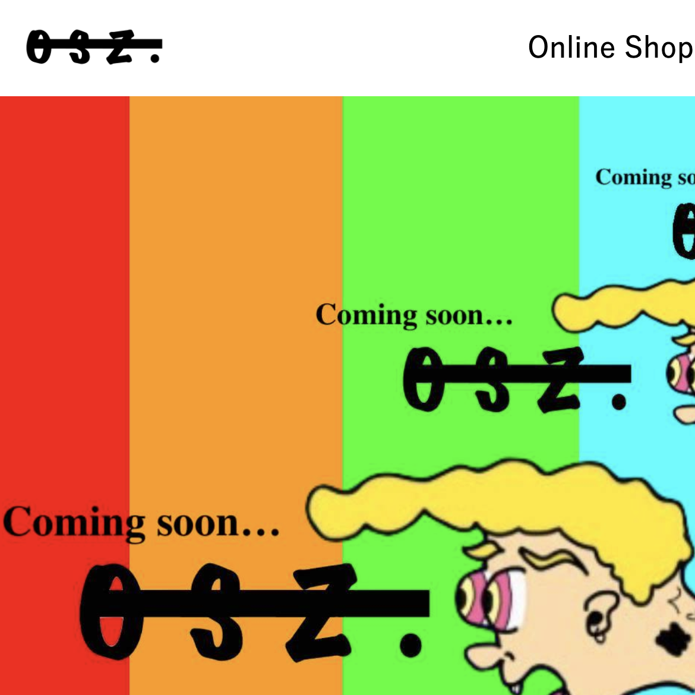

<!DOCTYPE html>
<html lang="ja" dir="ltr">
  <head>
    <meta charset="utf-8">
    <title></title>
    <link rel="stylesheet" href="inowootancopy.css">
    <link href="https://use.fontawesome.com/releases/v5.6.1/css/all.css" rel="stylesheet">
    

  </head>
  <body>
    

      

        
Welcome to Channel of

        <h1 display="block" class="title-word">Inowootan</h1>
        

          <a href="#" class="enter">ENTER</a>
        

      

    

    

      

        

          
Channel

          <h1>Inowootan</h1>
        

        

          

            <a href="#jump-contact">
Contact
</a>
          

          

            <a href="#jump-profile">
Profile
</a>
          

          

        

      

      

        <h1>Portfolio Sites</h1>
      

      

        

          
          <a href="https://osz-onesevenzero.github.io/Home/" target=”_blank”><h1 class="name">OSZ Bland Homepage</h1> </a>
          
依頼を受け、ホームページを作成した物です。

          
作成期間：2日

        

        

            
            <a href="https://omidoridofu.github.io/"　target=”_blank”><h1 class="name">Sweat Berry Dispensary</h1></a>
            
大麻ショップのホームページをイメージしました

            
※内容は全て架空のものです※

        

      

      

        

          <h1 id="jump-contact">Contact</h1>
          
お問い合わせ

        

        

          

            <form  action="inowootan-form.php" method="post">
            
お名前(必須)

            <input type="text" class="input-write" name="name" value="">
            
メールアドレス(必須)

            <input type="text" class="input-write" name="adress" value="">
            
題名

            <input type="text" class="input-write" name="title" value="">
            
内容

            <textarea  name="content"　rows="8" cols="80"></textarea>
            

              <input type="submit" class="input-submit" value="送信" >
            

            </form>
          

          

            
E-Mail:yousk831inou3@icloud.com

             
            
Tell:090-3168-5069

          

        

        

          

            <h1 id="jump-profile">Profile</h1>
            
プロフィール

          

          

            <h1>Inowootan</h1>
            
            <a href="#">
クラウドワークスのプロフィールはこちら
</a>

            
2020年1月よりHTML&CSSを始めとしたWeb作成の学習をスタートしました。

            
Web作成の依頼など、是非ご相談ください。

            

        

      

    

    

  </body>
</html>
